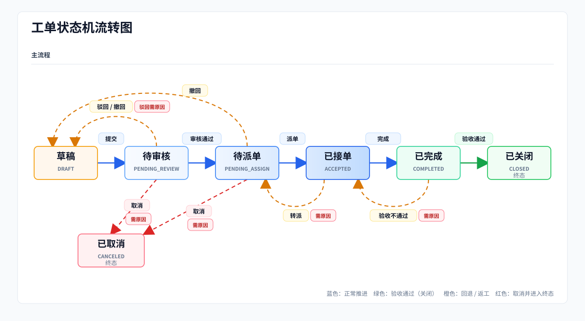

# 智能工单系统

基于 Spring Boot 3 + Vue 3 的企业内部工单协作系统，覆盖工单提交、审核、派单、处理、验收、用户管理和部门管理等场景。

项目模拟企业内部 IT / OA 支持流程，重点展示完整业务闭环、多角色协同、权限控制和操作留痕。

> 前端仓库：[work-order-system-web](https://github.com/calixforge/work-order-system-web)

## 功能亮点

- **完整工单闭环**：支持草稿、提交、审核、派单、接单、完成、验收关闭、驳回、转派、取消等流程。
- **多角色协作**：内置提单人、审核员、派单人、接单人、管理员五类角色，贴近企业内部工单分工。
- **权限与组织管理**：支持用户、角色、部门管理，一人多角色时按权限并集处理。
- **过程可追溯**：工单流转记录完整保留，详情页可查看每一步操作和处理结果。
- **容器化部署**：提供 Docker Compose 部署方案，整合后端、前端、MySQL、Redis 和 Nginx。
- **接口文档**：集成 Knife4j / OpenAPI，方便本地调试和联调。

## 功能模块

| 模块 | 功能 |
| --- | --- |
| 登录认证 | 登录、退出、登录状态校验、密码修改 |
| 用户管理 | 用户创建、编辑、停用、启用、密码重置、角色分配 |
| 部门管理 | 部门创建、编辑、删除、查询和历史引用校验 |
| 工单管理 | 工单创建、提交、撤回、取消、审核、派单、接单、完成、验收 |
| 工单查询 | 我的工单、待审核工单、待派单工单、我负责的工单、全部工单 |
| 流转日志 | 记录工单状态变化、操作人、操作时间和处理说明 |

## 技术栈

| 分类 | 技术 |
| --- | --- |
| 后端框架 | Spring Boot 3.3.5、Spring MVC |
| 数据访问 | MyBatis-Plus、MySQL |
| 登录与缓存 | JWT、Redis、BCrypt |
| 接口文档 | Knife4j、OpenAPI 3 |
| 部署 | Docker Compose、Nginx |

## 业务流程

工单主流程如下：



## 角色说明

| 角色 | 说明 |
| --- | --- |
| `SUBMITTER` | 创建工单、提交工单、撤回、取消、验收 |
| `REVIEWER` | 审核本部门提交的工单 |
| `DISPATCHER` | 查看待派单工单并分配接单人 |
| `HANDLER` | 处理分配给自己的工单，支持完成和转派 |
| `ADMIN` | 管理用户、角色、部门，并查看全部工单 |

## 项目结构

```text
src/main/java/com/wos
├── common          # 通用响应、分页、权限检查、用户上下文
├── config          # 项目配置
├── controller      # 接口层
├── domain          # DTO、实体、VO
├── exception       # 异常处理
├── mapper          # 数据访问
├── service         # 业务接口
├── service/impl    # 业务实现
└── util            # 工具类
```

## 快速启动

### 环境要求

- JDK 17+
- Maven 3.8+
- MySQL 5.7+
- Redis 6+

### 初始化数据库

创建数据库：

```sql
CREATE DATABASE work_order_system DEFAULT CHARACTER SET utf8mb4;
```

依次执行：

```text
sql/work_order_system.sql
sql/init_data.sql
```

初始化账号：

```text
用户名：admin
密码：admin123
```

### 本地配置

项目默认启用 `local` profile，请创建：

```text
src/main/resources/application-local.yml
```

可复制 [application-local.example.yml](src/main/resources/application-local.example.yml) 为 `application-local.yml`，并按本机 MySQL / Redis 情况填写真实值。

### 启动后端

```bash
./mvnw spring-boot:run
```

Windows：

```powershell
.\mvnw.cmd spring-boot:run
```

## Docker 部署

项目提供 Docker Compose 部署方案，可一次性启动后端服务、前端页面、MySQL、Redis 和 Nginx。

详细部署步骤、目录结构、`.env` 配置和验证方式见 [Docker 部署指南](docs/docker-deploy.md)。

## 接口文档

项目集成 Knife4j，启动后可在浏览器访问：

```text
http://localhost:8080/doc.html
```

除登录接口、接口文档和静态资源外，其他接口都需要携带：

```http
Authorization: Bearer <token>
```
